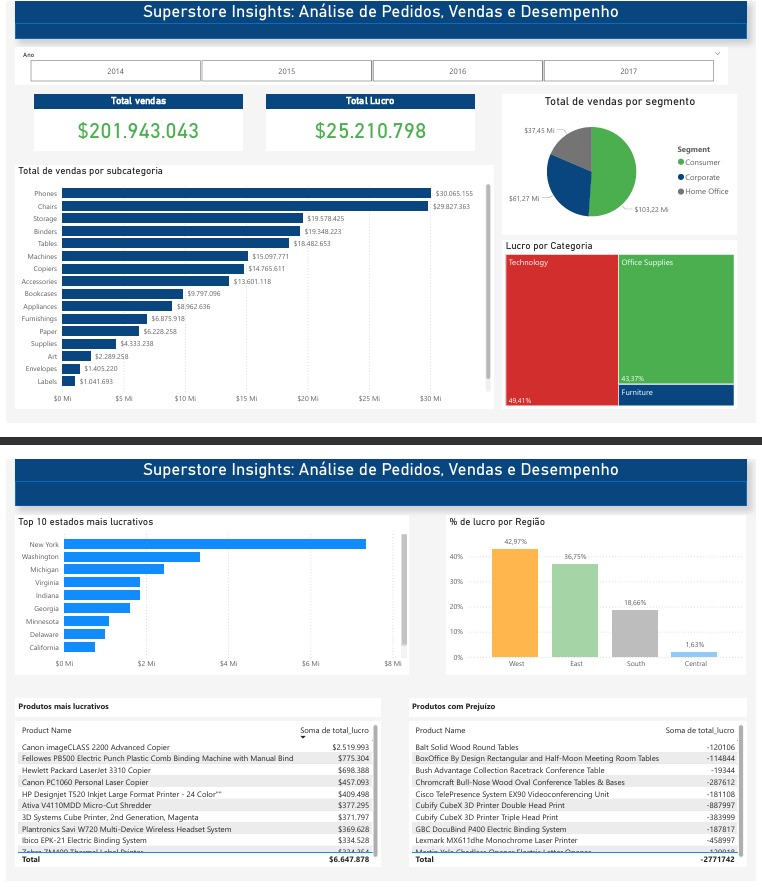

# analise-superstore-sql-powerbi
 Análise de vendas e lucros no Superstore Dataset usando SQL e Power BI para gerar insights sobre produtos, categorias e regiões.
 
# 📊 Projeto SQL – Análise de Vendas e Lucro com o Superstore Dataset

Este projeto tem como objetivo realizar uma análise exploratória usando SQL a partir do dataset "Superstore" (Kaggle). Através de diversas consultas, foram extraídos insights relevantes sobre vendas, lucro, clientes e performance por categoria, tempo e região.

---

##  Fonte de Dados

- Dataset: [Superstore Dataset](https://www.kaggle.com/datasets/vivek468/superstore-dataset-final)
- Formato: CSV
- Origem: Kaggle
- Tabela utilizada: `pedidos`

---

##  Objetivos da Análise

- Avaliar o desempenho de vendas por categoria e subcategoria e segmento
- Identificar pedidos com prejuízo (lucro negativo)
- Analisar evolução mensal de vendas e lucro
- Identificar estados com maior volume de compras
- Produtos mais e menos vendidos

---

##  Ferramentas utilizadas

- MySQL
- MySQL Workbench
- Power BI para visualização

---
##  Estrutura do Projeto

| Nº | Query | Descrição |
|----|-------|-----------|
| 01 | `01_produtos.sql` | Detalhamento de produtos por data: Categoria, segmento, valor |
| 02 | `02_top10_estados_lucrativos.sql` | 10 estados com mais lucro |
| 03 | `03_vendas_por_regiao.sql` | Total de vendas e lucro por região |
| 04 | `04_top10_produtos_lucrativos.sql` | Os 10 produtos mais lucrativos |
| 05 | `05_top10_produtos_com_prejuizo.sql` | Os 10 produtos que trouxeram prejuízo |

---
## 📸 Visualizações

- Visualizações Para complementar, segue o PDF gerado no Power BI com os dashboards interativos criados a partir dessas consultas.

**Anexo: Dashboard Power BI - Superstore**

---

## Principais insights extraídos do relatório
- A análise mostrou que os 10 estados mais lucrativos representam grande parte do lucro total. Isso indica forte concentração regional nas vendas mais rentáveis.
- Foram localizados pedidos com lucro negativo, permitindo investigar causas como descontos excessivos, custos logísticos ou políticas comerciais pouco eficientes.
- Algumas categorias, como “Technology”, apresentaram maior lucratividade média por pedido, enquanto “Furniture” teve maior variação de margem, incluindo casos de prejuízo.
- Os 10 produtos mais lucrativos geraram lucro significativo, enquanto os 10 produtos que trouxeram prejuízo contribuíram para redução do resultado geral — possível foco para reavaliação.
- A região Oeste teve maior volume de vendas, enquanto a região Sul apresentou maior margem de lucro relativa, indicando diferentes estratégias podem ser aplicadas regionalmente.

---

## Conclusão
Com base na análise exploratória realizada sobre o dataset Superstore, foi possível identificar padrões importantes nas vendas e no lucro da empresa. Destacaram-se a concentração de lucro em alguns estados, a sazonalidade das vendas e os impactos de produtos e pedidos com prejuízo no resultado geral.

Esses insights reforçam a importância de monitorar de perto a performance por região, categoria e produto, além de rever estratégias comerciais para reduzir casos de prejuízo. Como próximos passos, recomenda-se aprofundar a análise para entender causas específicas desses prejuízos, além de explorar tendências de longo prazo e oportunidades de crescimento em regiões menos lucrativas.

O projeto mostrou como o uso combinado de SQL para análise de dados e Power BI para visualização permite transformar dados brutos em informações estratégicas para apoiar a tomada de decisão.

---

## Sobre mim
 [LinkedIn](https://www.linkedin.com/in/elisangeladias-dados/) | 📊 [Kaggle](https://www.kaggle.com/elisdias) | 💻 [GitHub](https://github.com/elisdiasds)

